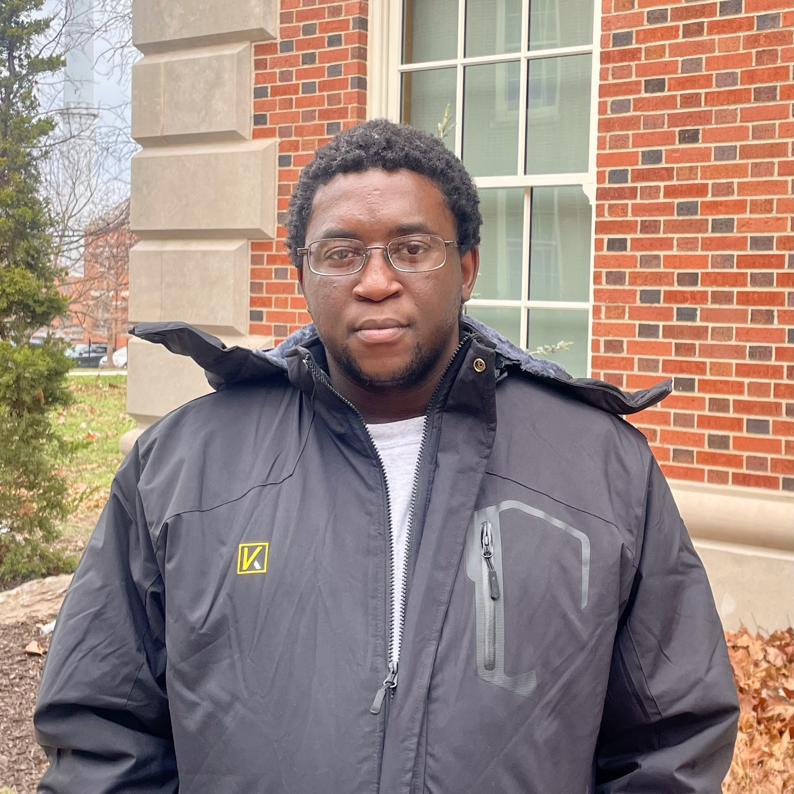

### Tive B.P. Khumalo, BSc Physics & Mathematics (Mathematical Statistics and Financial Mathematics), M.A. Statistics, Measurement and Evaluation

Graduate Student, Statistics, Measurement, and Evaluation in Education\

::::: grid
::: g-col-3
{style="border-radius: 50%;   height: 10em;    width: 10em;" fig-alt="headshot placeholder"}
:::

::: g-col-9
Tive Khumalo received a BSc in Physics and Mathematics from the University of Eswatini (formerly Swaziland) in 2019 and an MA in Statistics, Measurement, and Evaluation in Education from the University of Missouri–Columbia in 2024 through the Fulbright Program. He is currently a PhD candidate in Statistics, Measurement, and Evaluation at the University of Missouri–Columbia. His research focuses on Bayesian statistical methods and regularization, particularly the development and evaluation of statistical approaches for improving estimation, model selection, and prediction in complex models. His methodological interests include Bayesian shrinkage priors, computational statistics, and model evaluation, with applications in structural equation modeling, psychometrics, longitudinal data analysis, and machine learning.

 [CV](static/Tive_Khumalo_CV.pdf)\
<!---  [Google Scholar Profile](https://scholar.google.com/citations?user=yXLOreMAAAAJ&hl=en&oi=ao) --->
:::
:::::
